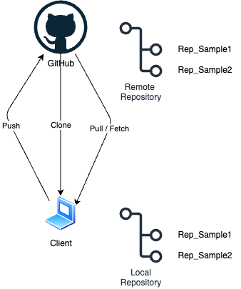

# 使う前に知っておきたい基礎知識
GitHubを使用する上で知っておきたい用語

- __リポジトリ（Repository）__

    __[概要]__

    コードや履歴（コミット）を保存する“箱”。変更の履歴をたどれます。

    

    __[代表コマンド]__

    ```
    git init                 # 新規ローカルリポジトリを作成
    git clone <url>          # 既存リモートを複製してローカルに作成
    git remote -v            # ひも付くリモート一覧を確認
    git remote add origin <url>  # リモートを追加
    ```

    - __ローカルリポジトリ（Local Repository）__

        __[概要]__

        Local PC上のリポジトリ<br>
        編集とコミットはここで実施（pushするまで他者は見えない）

    - __リモートリポジトリ（Remote Repository）__

        __[概要]__

        GitHub上のリポジトリ<br>
        チーム共有の“正”<br>
        CI/CDの起点にもなる

- __ブランチ（Branch）__

    __[概要]__
    
    作業ラインを分岐させる仕組み<br>
    安全に機能追加や修正を進められる

    ```
    git branch                         # ブランチ一覧
    git checkout -b ローカルブランチ名 origin/リモートブランチ名
    git switch XXXX                    # 既存ブランチに切替
    ```

    - ローカルブランチ（Local Branch）

        __[概要]__

        Localだけに存在<br>
        pushすると対応するリモートブランチを作成できる

    - リモートブランチ（Remote Branch）

        __[概要]__

        GitHub上のBranch

- 追加（add）

    __[概要]__

    変更ファイルを“ステージ”（コミット対象）に載せる。
    ```
    git add <file>   # 単体ファイルをステージ
    git add .        # 変更済みを一括ステージ
    git add -p       # 対話的に一部だけステージ
    ```

- コミット（commit）

    __[概要]__

    ステージされた変更を“履歴スナップショット”として記録
    ```
    git commit -m "変更の要約"       # コミット作成
    git commit --amend             # 直前コミットを修正
    ```

- プッシュ（push）

    __[概要]__

    ローカルのコミットをリモートへ送信し共有する
    ```
    git push                    # 追跡ブランチへ送信
    git push -u origin master   # 初回は -u で追跡設定

    ```

- プルリクエスト（Pull Request (PR)）

    __[概要]__

    ブランチの変更を別ブランチ（例：master）へ取り込む __依頼__<br>
    レビューやCIチェック、議論の場として使う（操作はGitHubのWeb UIで行うのが一般的）

    __基本の流れ__

        - Compare & pull request を作成

        - レビュー依頼

        - 承認後にMerge

- マージ（Merge）

- ステータス（status）

- コンフリクト（conflict）

- フェッチ（fetch）

- チェリーピック（cherry pick）
