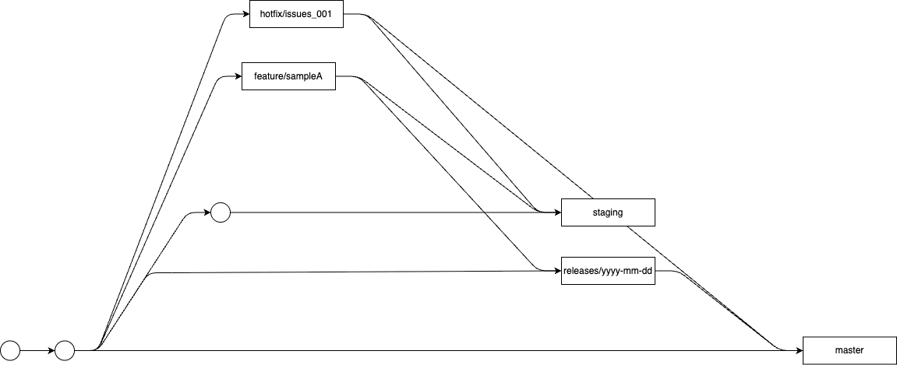

# Git戦略

__[概要]__

案件ごとに最適なGit運用は異なりますが、判断の“軸”を持って選ぶことが重要です。<br>
ここでは**基本方針 → 戦略の選び方 → 具体例（2環境/3環境・リリース/ホットフィックス）**の順でまとめます。



__[基本方針]__

**Branch役割**
```
    master = 公開環境

    staging = 結合テスト

    feature/* = 開発

    hotfix/* = 緊急修正

    releases/yyyy-mm-dd = リリース
```

## masterについて

## stagingについて

## featureについて
    